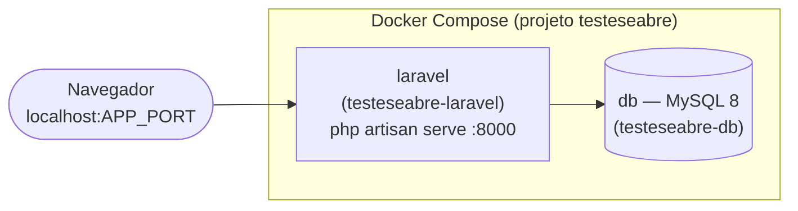

# CRUD de clientes — Laravel


> **Resumo:** aplicação web para cadastro de clientes (teste técnico), com **login**, **CRUD completo** protegido por autenticação e **preenchimento de endereço via CEP** (ViaCEP). O ambiente de desenvolvimento roda em **Docker Compose** (PHP/Laravel + MySQL).

Checklist de fases de desenvolvimento: [`TASKS.md`](./TASKS.md).

---

## Pré-requisitos

- [Docker Desktop](https://www.docker.com/products/docker-desktop/) (ou Docker Engine + Docker Compose v2)
- Opcional (sem Docker): PHP ^8.2 e [Composer](https://getcomposer.org/)

---

## Execução

Na **raiz do repositório** (onde está o `docker-compose.yml`):

1. (Opcional) Copie o exemplo de variáveis da raiz:

   ```bash
   copy .env.example .env
   ```

   No Linux/macOS: `cp .env.example .env`

2. Suba os containers:

   ```bash
   docker compose up --build
   ```

3. Acesse **http://localhost:8000** (ou a porta em `APP_PORT` no `.env` da raiz).

Para rodar em segundo plano:

```bash
docker compose up --build -d
```

Parar mantendo o volume do MySQL:

```bash
docker compose down
```

Apagar também os dados do banco:

```bash
docker compose down -v
```

> Na primeira subida, o entrypoint do container **laravel** pode executar `composer install`, gerar `APP_KEY` e `php artisan migrate` contra o MySQL.

---

## Ambiente Docker (visão geral)

Os serviços **`laravel`** e **`db`** ficam na rede interna do Compose; o Laravel usa o hostname **`db`** para o MySQL.



| Serviço (Compose) | Container | Função |
|-------------------|-----------|--------|
| **laravel** | `testeseabre-laravel` | Build `app/Dockerfile`, volume `./app`, expõe **8000** (ou `APP_PORT`). |
| **db** | `testeseabre-db` | MySQL 8, volume persistente `mysql_data`. |

---

## Variáveis de ambiente

Dois contextos: **raiz** (só Compose) e **app/** (Laravel).

### Raiz do repositório (`/.env`)

Opcional; copie de [`.env.example`](./.env.example). Afeta principalmente portas e credenciais injetadas no Compose.

| Variável | Descrição |
|----------|-----------|
| `APP_PORT` | Porta publicada da aplicação (padrão **8000**). |
| `APP_ENV` / `APP_DEBUG` | Ambiente e modo debug no container. |
| `DB_DATABASE`, `DB_USERNAME`, `DB_PASSWORD` | Banco MySQL usado pelo serviço **db** e referenciado pelo Laravel no Docker. |
| `MYSQL_ROOT_PASSWORD` | Senha do root do MySQL. |
| `FORWARD_DB_PORT` | Porta do MySQL no host (padrão **3306**). |

### Pasta `app/` (`app/.env`)

Copie de [`app/.env.example`](./app/.env.example). No **Docker**, parte desses valores é sobrescrita pelo ambiente do Compose (`DB_*`, `APP_URL`, etc.).

| Variável | Descrição |
|----------|-----------|
| `APP_KEY` | Chave da aplicação (obrigatória; `php artisan key:generate`). |
| `APP_URL` | URL base; deve coincidir com o que você abre no navegador (ex.: `http://localhost:8000`). |
| `DB_*` | Conexão: no Docker costuma ser **mysql** e host **`db`**. |
| `SESSION_DRIVER` | Ex.: `database` (exige tabela `sessions`). |
| `SESSION_SECURE_COOKIE` | Em **HTTP** local, use **`false`** para evitar erro **419** (sessão/CSRF). |
| `CACHE_STORE` / `QUEUE_CONNECTION` | Padrão `database` no exemplo (exige migrations de cache/jobs). |

---

## Infraestrutura: Laravel, Dockerfile e Compose

### Projeto Laravel

Criado na pasta `app/` com Composer (`composer create-project laravel/laravel app`). **Laravel 12**, PHP compatível **^8.2**; em Docker a imagem usa **PHP 8.3 CLI**.

### Dockerfile (`app/Dockerfile`)

Imagem **PHP 8.3 CLI** (`php:8.3-cli-bookworm`) com extensões **pdo_mysql**, **mbstring**, **pcntl**, **bcmath**, **zip**, **intl**, **Git**, **Unzip**, **Composer 2** e entrypoint `docker-entrypoint.sh` (dependências, `APP_KEY`, migrações, `php artisan serve`).

O arquivo `app/.dockerignore` reduz o contexto de build.

> **Comandos Artisan dentro do container** (com os serviços no ar, na pasta da raiz do repositório):
>
> ```bash
> docker compose exec laravel php artisan migrate
> ```
>
> Ou pelo nome do container:
>
> ```bash
> docker exec testeseabre-laravel php artisan migrate
> ```

---

## Autenticação com Laravel Breeze

Pacote **[Laravel Breeze](https://laravel.com/docs/starter-kits#laravel-breeze)** (Blade + Vite): login, registro, logout, recuperação de senha e verificação de e-mail.

Instalação de referência (já aplicada no projeto):

```bash
composer require laravel/breeze --dev
php artisan breeze:install blade
npm install && npm run build
```

A tabela **`users`** segue a migration padrão. Após clonar, execute **`php artisan migrate`** com o banco vazio.

**Rotas:** `/dashboard` usa `middleware(['auth', 'verified'])`; o **CRUD de clientes** (`Route::resource('clientes', ClientController::class)`) está no mesmo grupo em `routes/web.php`.

---

## Modelagem da tabela `clientes` e CRUD

Migration `database/migrations/2026_05_09_200548_create_clientes_table.php` — tabela **`clientes`**:

| Campo | Observação |
|-------|------------|
| `nome` | string |
| `email` | string, **único** |
| `telefone` | string (32) |
| `cep` | string (9) |
| `rua`, `bairro`, `cidade` | string |
| `estado` | string (2), UF |
| `created_at` / `updated_at` | timestamps |

**CRUD (resumo):**

| Peça | Caminho |
|------|---------|
| Controller resource | `app/Http/Controllers/ClientController.php` |
| Validação | `app/Http/Requests/ClientRequest.php` |
| Views | `resources/views/clients/` (`index`, `create`, `edit`, `show`, `_form`) |
| Rotas | `Route::resource('clientes', …)` com `auth` + `verified` |

Exclusão com confirmação via `data-confirm` e script em `resources/views/layouts/app.blade.php`.

---

## Busca de CEP (ViaCEP)

O formulário (`resources/views/clients/_form.blade.php`) consulta o CEP no **blur** do campo, via **[ViaCEP](https://viacep.com.br/)** (`GET https://viacep.com.br/ws/{cep}/json/`), preenchendo **rua**, **bairro**, **cidade** e **estado** a partir de `logradouro`, `bairro`, `localidade` e `uf`.

<details>
<summary><strong>Nota — API oficial dos Correios</strong></summary>

Não há integração com a API institucional dos Correios (**CWS**/contrato/homologação) neste momento. Foi aberto chamado no suporte; prazo informado de **até 5 dias úteis** para retorno. Até lá a ViaCEP cobre o requisito de endereço automático no ambiente de desenvolvimento.

**Comprovante de contato (substitua pelo seu arquivo ou pela URL da imagem):**

```markdown

```

*(Adicione o print em `docs/` ou ajuste o caminho acima.)*

</details>

---

## Interface (opcional)

Uma captura de tela da aplicação em uso melhora a documentação. Substitua o caminho quando tiver o arquivo:

```markdown

```

---

## Desenvolvimento local sem Docker

Na pasta `app/`: copie `.env.example` para `.env`, configure o banco (ex.: SQLite) e:

```bash
composer install
php artisan key:generate
php artisan migrate
php artisan serve
```

---

## Estrutura do repositório

```text
.
├── docker-compose.yml
├── .env.example          # variáveis opcionais para o Compose (raiz)
├── README.md
└── app/
    ├── Dockerfile
    ├── docker-entrypoint.sh
    ├── .env.example      # Laravel
    └── …                 # projeto Laravel (app/, resources/, routes/, …)
```

---

